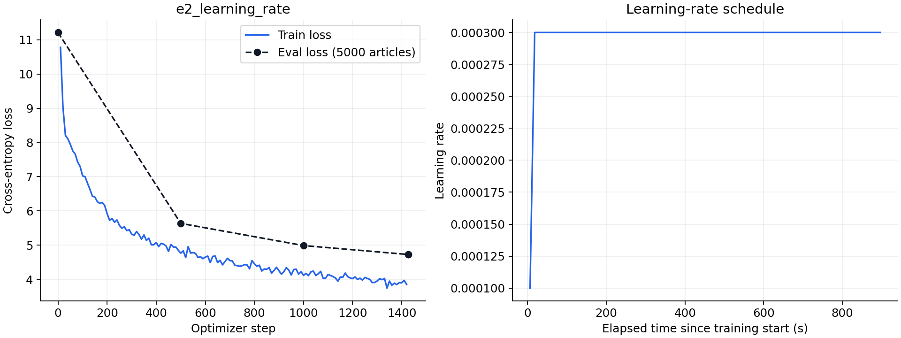

# ДЗ 1: мини-претрейн языковой модели

Папка с отчётом и кодом: [GitHub](https://github.com/DenisMRH/llm-hse-course/tree/main).

Код: [your_solution.py](your_solution.py). Численные результаты, параметры и история loss: [results](results).

## Проведённые эксперименты

Завершено 3 экспериментов. Каждый запуск обучает с нуля Qwen3 со скелетной архитектурой — **960 881 664 параметра** — на одной **NVIDIA H100 PCIe 80 GB**. Лимит обучения — 900 секунд; остановка происходит после ближайшего завершённого шага. Подготовка модели, начальная оценка, сохранение и генерация выполняются отдельно.

Использованы `wikimedia/wikipedia`, `20231101.ru`, 1 945 063 статьи, токенизатор `ai-forever/rugpt3small_based_on_gpt2`, длина 512. Первые 5000 статей используются для оценки, остальные 1 940 063 — для обучения. Разделение фиксировано, seed=42. Порядок данных после сохранения Parquet проверен. PAD исключён из loss через labels=-100.

- **E1**: Базовый запуск: LR 5e-5, постоянный LR после warmup.
- **E2**: Увеличен только LR до 3e-4 относительно E1.
- **E3**: Добавлено косинусное снижение LR относительно E2.

## Испробованные гиперпараметры

| Запуск | Microbatch | Accumulation | Effective batch | LR | Scheduler | Optimizer | BF16 | TF32 | Compile |
|---|---:|---:|---:|---:|---|---|---|---|---|
| E1 | 8 | 4 | 32 | 5e-05 | constant | adamw_torch | да | да | нет |
| E2 | 8 | 4 | 32 | 0.0003 | constant | adamw_torch | да | да | нет |
| E3 | 8 | 4 | 32 | 0.0003 | cosine | adamw_torch | да | да | нет |

Во всех запусках: warmup=30 шагов, weight decay=0.01, gradient clipping=1.0, gradient checkpointing выключен. Scheduler после warmup использует прошедшее время относительно 900-секундного бюджета: constant либо cosine. Промежуточная оценка проводится каждые 500 шагов; её время входит в бюджет. Финальная оценка использует все 5000 отложенных статей.

## Графики loss


На общем графике тонкие линии показывают исходный train loss, основные линии — скользящее среднее 10 записей. Входные позиции включают PAD, поэтому скорость обработки позиций не равна скорости обработки только содержательных токенов.




Графики отдельных запусков: [E1](results/e1_baseline_loss.png), [E2](results/e2_learning_rate_loss.png), [E3](results/e3_cosine_loss.png).

## Финальный eval_loss

| Запуск | Начальный eval loss | Финальный eval_loss | Шагов | Остановка по лимиту, с | Пик GPU-памяти, GiB |
|---|---:|---:|---:|---:|---:|
| E1 | 11.2160 | **6.4404** | 1428 | 900.30 | 15.70 |
| E2 | 11.2160 | **4.7272** | 1427 | 900.54 | 15.70 |
| E3 | 11.2160 | **4.9112** | 1428 | 900.37 | 15.70 |

Минимальный eval_loss среди завершённых запусков: **4.7272**, запуск **E2**.

## Примеры генераций модели

Для каждого запуска сохранены продолжения одинаковых пяти промптов: greedy и sampling (`temperature=0.8`, `top_p=0.9`, до 80 новых токенов). Ниже — greedy-генерации лучшего завершённого запуска; тексты приведены без исправления ошибок.

**Промпт: «Москва — это»**

```text
Москва — это аббревиатура, используемый для обозначения в виде.

История 
В начале XIX века в России в России в России в России, в России, в России, в России, в России, в России, в России, в России, в России, в России, в России, в России, в России, в России, в России, в России, в России, в России
```

**Промпт: «Солнечная система состоит из»**

```text
Солнечная система состоит из двух основных компонентов:


```

**Промпт: «В начале XX века»**

```text
В начале XX века, в России, в России, в России, в России, в России, в России, в России, в России, в России, в России, в России, в России, в России, в России, в России, в России, в России, в России, в России, в России, в России, в России, в России, в России, в России, в России, в
```

Все генерации: [E1](results/e1_baseline/generations.json), [E2](results/e2_learning_rate/generations.json), [E3](results/e3_cosine/generations.json).

## Выводы и наблюдения

- В базовом запуске eval loss снизился с 11.2160 до 6.4404: модель научилась некоторым закономерностям текста за ограниченное время.
- Среди проверенных конфигураций минимальный eval loss получен в E2: 4.7272. Это лучший результат этой серии, а не доказательство глобально оптимальных гиперпараметров.
- Сравнение проводится при одинаковом времени, а не одинаковом числе шагов. Поэтому качество зависит и от параметров оптимизации, и от скорости обработки данных.
- Результаты получены на H100, а не A100; прямое сравнение числа шагов с запусками на A100 некорректно. Использован один seed, повторов для оценки разброса нет. Отложенная выборка используется для выбора параметров и не является дополнительным независимым тестом.
