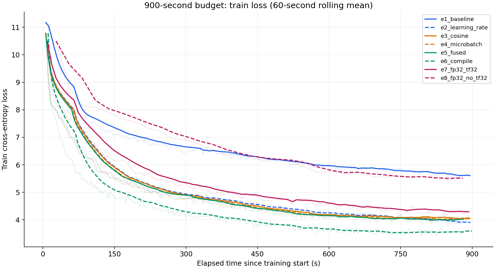
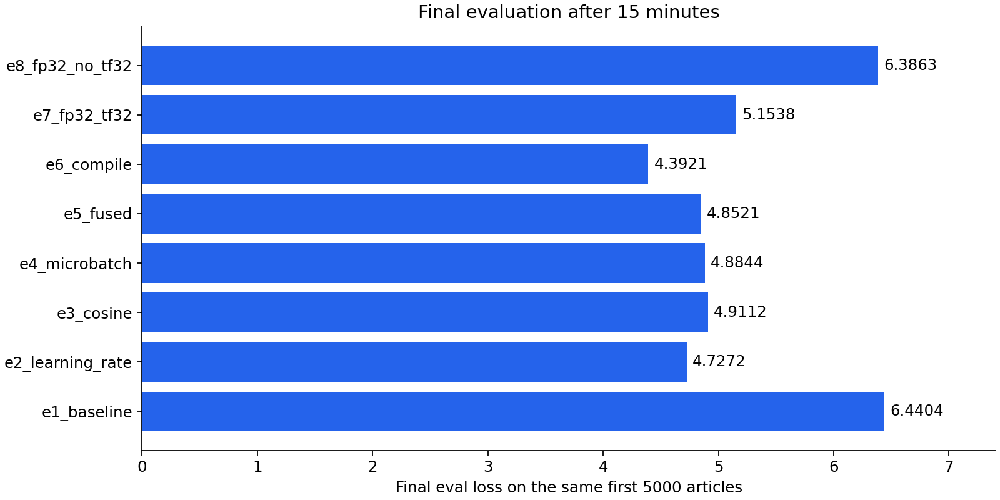
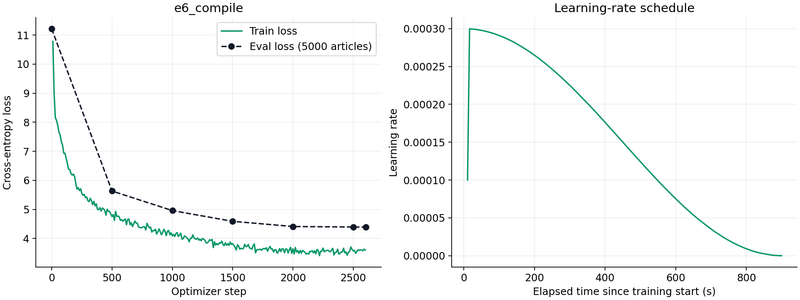

# ДЗ 1: мини-претрейн LLM

Папка для сдачи: [GitHub](https://github.com/DenisMRH/llm-hse-course/tree/main). [Код](your_solution.py), [логи и параметры](results), [команды запуска](README.md).

## Проведённые эксперименты

Проведено 8 независимых запусков Qwen3 с нуля (960 881 664 параметра), каждый с лимитом 15 минут на одной H100 80 GB. Во всех запусках seed=42, русская Wikipedia `20231101.ru`, токенизатор `ai-forever/rugpt3small_based_on_gpt2`, длина 512. Первые 5000 из 1 945 063 статей используются для оценки, остальные — для обучения. PAD исключён из loss.

E1 — базовый запуск; E2 — увеличение learning rate; E3 — cosine scheduler; E4 — больший microbatch при прежнем effective batch; E5 — fused AdamW; E6 — torch_compile; E7 — FP32 с TF32; E8 — FP32 без TF32.

## Испробованные гиперпараметры

| Запуск | Batch × accumulation | LR | Scheduler | Optimizer | BF16 | TF32 | Compile |
|---|---|---:|---|---|---|---|---|
| E1 | 8 × 4 | 5e-05 | constant | AdamW | да | да | нет |
| E2 | 8 × 4 | 0.0003 | constant | AdamW | да | да | нет |
| E3 | 8 × 4 | 0.0003 | cosine | AdamW | да | да | нет |
| E4 | 16 × 2 | 0.0003 | cosine | AdamW | да | да | нет |
| E5 | 16 × 2 | 0.0003 | cosine | fused AdamW | да | да | нет |
| E6 | 16 × 2 | 0.0003 | cosine | fused AdamW | да | да | да |
| E7 | 16 × 2 | 0.0003 | cosine | fused AdamW | нет | да | нет |
| E8 | 16 × 2 | 0.0003 | cosine | fused AdamW | нет | нет | нет |

Effective batch во всех запусках — 32. Warmup — 30 шагов, weight decay — 0.01, gradient clipping — 1.0. Cosine снижает LR по прошедшему времени относительно 900 секунд. FP32 использует SDPA, BF16 — Flash Attention 2; архитектура модели сохраняется.

## Графики loss



Тонкие линии — исходный train loss, основные — среднее за последние 60 секунд. Время включает промежуточную оценку каждые 500 шагов.





## Финальный eval_loss

| Запуск | eval_loss | Шагов |
|---|---:|---:|
| E1 | 6.4404 | 1428 |
| E2 | 4.7272 | 1427 |
| E3 | 4.9112 | 1428 |
| E4 | 4.8844 | 1496 |
| E5 | 4.8521 | 1501 |
| E6 | 4.3921 | 2603 |
| E7 | 5.1538 | 928 |
| E8 | 6.3863 | 328 |

**Лучший результат: E6, eval_loss = 4.3921.** Начальный eval loss был около 11.21. Финальная оценка выполнена на всех 5000 отложенных статьях.

Лимит проверяется после шага. Большинство остановок произошли около 900–903 с; E5 остановился на 913.66 с, потому что промежуточная оценка пересекла границу. Сохранение и финальная оценка требуют дополнительного времени.

## Примеры генераций модели

Примеры E6 с sampling: temperature=0.8, top_p=0.9, top_k=50, до 80 новых токенов. Текст приведён без исправлений; все пять промптов в greedy и sampling сохранены в [generations.json](results/e6_compile/generations.json).

**«Москва — это»**

```text
Москва — это система производства, которое можно рассматривать как  для обозначения  на основе, которое имеет возможность, насколько они не только в зависимости от уровня.

Если у каждого количества, то есть, это число, если бы число, то есть только выше, не равна

, если не больше суммы, то есть точки  не может быть связано с тем, что в случае определённого или нет. Если у
```

**«Солнечная система состоит из»**

```text
Солнечная система состоит из двух частей:

  — одна из пяти основных частей;
  — семейство из трёх частей;
  — одна из крупнейших, использующих в составе, объединённых между двумя видами.
  — семейство таксонов из числа образцов, которые также включают в себя четыре вида:
  — вид полужестительных элементов,  и  — название ряда
```

**«В начале XX века»**

```text
В начале XX века в России насчитывается 4 человека, в них насчитывается пять видов птиц. В настоящее время на территории России встречается не только представители современных видов птиц.

Виды 
Впервые в России в России была представлена в 1960 году.

Описание 
В природе известны только как три вида. По этому показам в основном относятся к древнему типу, в основном из трёх крупных, которые с которыми
```

## Выводы и наблюдения

- LR 3e-4 оказался лучше 5e-5: eval loss 4.7272 против 6.4404. При microbatch 8 постоянный LR оказался лучше cosine (4.7272 против 4.9112).
- Увеличение microbatch и fused AdamW дали небольшие изменения качества. При увеличении microbatch память PyTorch выросла с 15.70 до 24.09 GiB.
- Самый заметный выигрыш дал torch_compile: 2603 шага против 1501 без него, eval loss 4.3921 против 4.8521. E6 использует кеш TorchInductor после короткой проверки и предварительный forward при начальной оценке; компиляция тренировочных графов входит в бюджет.
- FP32 с TF32 дал 5.1538 за 928 шагов, без TF32 — 6.3863 за 328 шагов. В этом FP32-окружении TF32 позволил сделать примерно в 2.83 раза больше шагов.
- Генерации воспроизводят энциклопедические обороты, но содержат ошибки согласования и бессвязные факты. Greedy зацикливается: на промпте про Солнечную систему повторяет переносы строк, на других — фразы. Sampling уменьшает точные повторы, но не исправляет смысл.
- Лучший eval loss среди этих запусков не означает лучшую конфигурацию во всех условиях. Использован один seed и H100; сравнение BF16/FP32 также меняет реализацию внимания. Отложенная выборка использовалась для выбора параметров.
